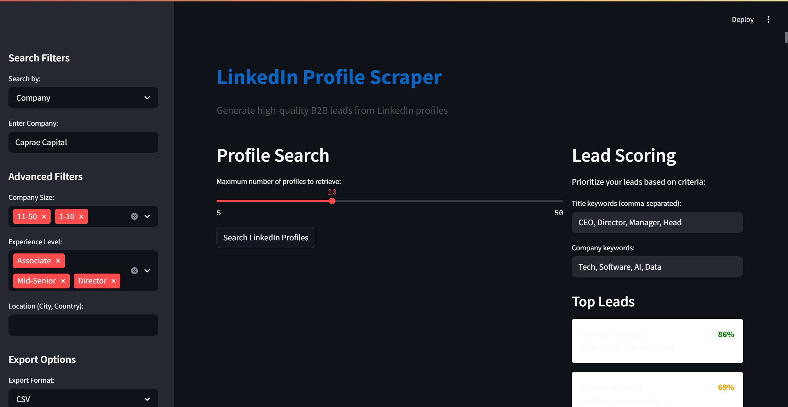

# 🔍 LinkedIn Profile Scraper  

This is a **Streamlit-based web app** that simulates a LinkedIn profile scraper. It generates realistic mock LinkedIn profiles using random data to demonstrate how lead generation and scoring works for B2B sales and outreach.


---

## 📸 Demo



---

## 🚀 Features

- 🎯 Filter by Job Title, Company, Location, or Industry
- 🧠 Advanced filters like Company Size & Experience Level
- 📄 Realistic fake LinkedIn profiles (name, title, skills, email, etc.)
- 📈 Lead Scoring system to prioritize high-potential leads
- 📥 Export data to CSV, Excel, or JSON
- 👀 Clean and responsive UI built with Streamlit

---

## 🛠️ Tech Stack

- **Frontend & Backend:** Streamlit
- **Language:** Python
- **Data Handling:** Pandas
- **Download Handling:** base64, BytesIO
- **UI Styling:** Custom CSS inside Streamlit

---

## ⚙️ How to Run

### ✅ Prerequisites

Make sure Python is installed. Then install dependencies:

```bash
pip install -r requirements.txt 
streamlit run app.py
